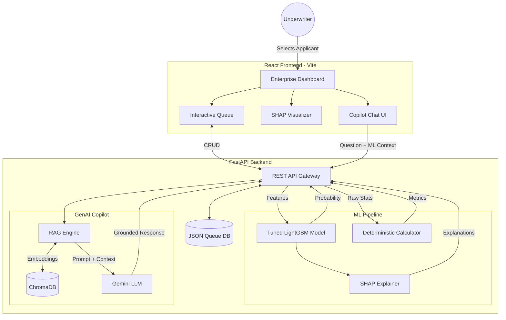

# CreditLens 🔍

**Explainable GenAI Credit Risk Copilot**

CreditLens is an enterprise-grade, full-stack data science platform that combines deterministic machine learning (LightGBM) with a Generative AI Copilot. It is designed to assist underwriters and risk analysts in evaluating loan applications by providing mathematically sound risk probabilities alongside RAG-grounded policy explanations.


## 🚀 Key Features

*   **Predictive ML Engine:** Trained on 150,000 historical credit records. Tuned using `Optuna` with a cross-validated LightGBM pipeline to predict the probability of default accurately while maintaining class balance (SMOTE).
*   **Explainable AI (XAI):** Implements `SHAP` (SHapley Additive exPlanations) to crack open the "black box," visualizing the exact positive and negative financial factors influencing each applicant's risk score.
*   **GenAI Copilot with RAG:** An embedded AI assistant powered by Gemini. Grounded in corporate credit policy using `ChromaDB` and embedding vectors. The AI answers policy questions with direct page citations and summarizes risk profiles.
*   **Strict AI Guardrails:** Built to prevent AI hallucinations in financial decisions. The LLM never computes math—all financial metrics (Debt-to-Income, Income Per Dependent) are processed by deterministic Python rules. The LLM acts strictly as an interpretation aid.
*   **Enterprise UI:** A highly interactive React + Tailwind dashboard. Features a real-time application queue, live status updates, and a searchable global database to lookup any application by ID.

## 🏗️ Architecture



## 🛠️ Tech Stack

*   **Machine Learning:** `Python`, `pandas`, `scikit-learn`, `LightGBM`, `SHAP`, `Optuna`, `imbalanced-learn`
*   **Generative AI / RAG:** `google-genai`, `ChromaDB`, `sentence-transformers`
*   **Backend:** `FastAPI`, `Uvicorn`, `Pydantic`
*   **Frontend:** `React`, `TypeScript`, `Vite`, `Tailwind v4`, `Recharts`, `lucide-react`
*   **Deployment:** `Docker`, `Docker Compose`

## ⚙️ Quick Start (Docker)

Ensure you have Docker and Docker Compose installed.

1. **Clone the repository:**
   ```bash
   git clone https://github.com/yourusername/creditlens.git
   cd creditlens
   ```

2. **Configure your environment:**
   Create a `.env` file in the root directory:
   ```env
   LLM_PROVIDER=gemini
   GEMINI_API_KEY=your_google_ai_studio_api_key
   GEMINI_MODEL=gemini-1.5-flash
   EMBEDDING_MODEL=all-MiniLM-L6-v2
   ```

3. **Launch the application:**
   ```bash
   docker-compose up --build
   ```

4. **Access the application:**
   * Frontend Dashboard: `http://localhost:5173`
   * Backend Swagger API Docs: `http://localhost:8000/docs`

## 📖 Project Phases Completed

- [x] **Phase 1-2:** EDA, Baseline Logistic Regression & RF
- [x] **Phase 3:** Advanced ML (Optuna, LightGBM, SMOTE)
- [x] **Phase 4:** SHAP Explainability & RAG DB Construction
- [x] **Phase 5:** LLM Orchestration & Guardrails Architecture
- [x] **Phase 6:** FastAPI Backend
- [x] **Phase 7:** Enterprise React Frontend
- [x] **Phase 8:** Interactive Queue & Real-time CRUD
- [x] **Phase 9:** Dockerization & Final Documentation

---
*Disclaimer: This project was built as a demonstration of applied Machine Learning and Generative AI for enterprise software engineering portfolios. It is not intended for real-world financial decision-making.*
