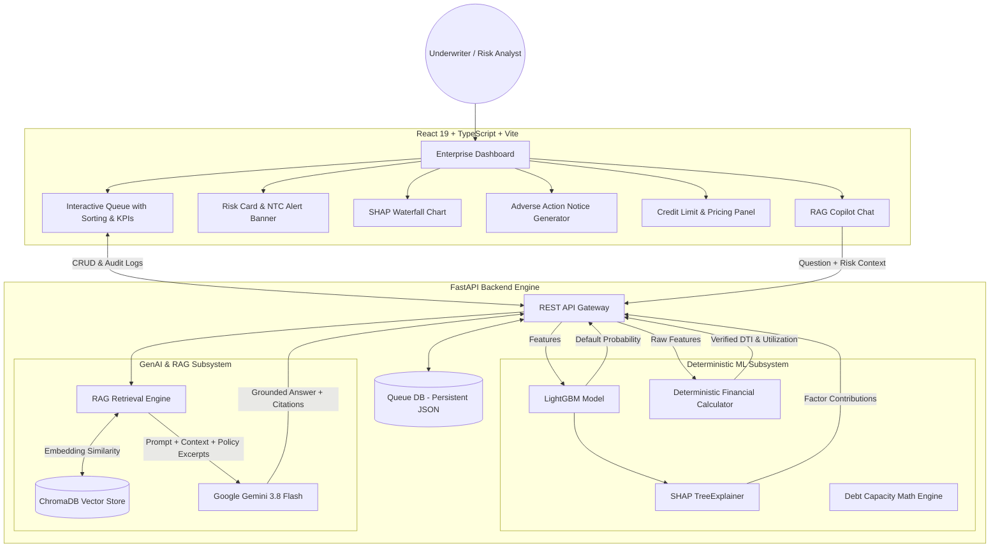

# 🔍 CreditLens — Explainable GenAI Credit Risk Copilot

> An enterprise-grade, full-stack credit risk platform combining deterministic machine learning (LightGBM), Explainable AI (SHAP), and RAG-grounded Generative AI — designed for underwriting operations at scale (Slice, Uni, KreditBee).

[🌐 Live Demo](https://eight-clocks-care.loca.lt) · [📖 Documentation](#-table-of-contents) · [🚀 Get Started](#-local-installation)

---

## 📋 Table of Contents

| Section | Purpose |
|---|---|
| [🧠 What is CreditLens?](#-what-is-creditlens) | Understanding the problem we solve in fintech lending |
| [⚡ Key Capabilities](#-key-capabilities) | All major features at a glance |
| [🏗️ System Architecture](#%EF%B8%8F-system-architecture) | System diagram & end-to-end data pipeline |
| [🤖 AI & RAG Subsystem](#-ai--rag-subsystem--google-gemini) | Vector store retrieval, policy grounding, and guardrails |
| [📊 Machine Learning Engine](#-machine-learning-engine--lightgbm--shap) | LightGBM optimization, SMOTE, and SHAP explainability |
| [🛡️ Regulatory & Audit Engine](#%EF%B8%8F-regulatory--audit-engine-rbi-grade) | Mandatory decision reason codes, audit trail, adverse action |
| [🧮 Credit Limit & Pricing Engine](#-credit-limit--risk-based-pricing-engine) | Debt capacity calculation, risk-based APR, stipulations |
| [🛠️ Technology Stack](#%EF%B8%8F-technology-stack) | Full list of libraries, frameworks, and infrastructure |
| [📁 Project Structure](#-project-structure) | Codebase organization |
| [💻 Local Installation](#-local-installation) | Step-by-step setup guide |
| [🔭 Interview Highlights](#-architecture-highlights-for-interviews) | Key engineering talking points for DS / MLE interviews |

---

## 🧠 What is CreditLens?

In modern fintech lending (such as BNPL, digital personal loans, and credit cards for New-to-Credit segments), traditional manual underwriting fails to scale. Thousands of applications arrive daily, requiring speed without sacrificing risk management or regulatory compliance.

### The Problem
```
Applicant applies → Black-box ML gives risk score → Underwriter doesn't know WHY 
→ Manual policy PDF search takes 20 mins → Denial notice typed manually from scratch 
→ No compliance audit trail → Slow, inconsistent, high RBI regulatory risk
```

### The Solution
```
Applicant applies → LightGBM scores default risk in 10ms → SHAP explains exact top 3 risk factors 
→ NTC / Thin-File flag alerts if bureau history is missing → RAG Copilot answers policy questions with page citations 
→ Decision reason logged with timestamp to permanent Audit Log → AI Adverse Action notice generated in 1 click 
→ Auto-Email/SMS notification dispatched to applicant
```

---

## ⚡ Key Capabilities

| Feature | Description |
|---|---|
| 📊 **Tuned LightGBM Predictor** | Trained on 150,000 credit records using Optuna hyperparameter optimization & SMOTE class balancing. |
| 🔍 **SHAP Explainable AI (XAI)** | Computes mathematical feature contributions (log-odds impact) for every single prediction, ending black-box risk scoring. |
| 🤖 **RAG-Grounded AI Copilot** | Vector search over corporate credit policy PDFs via ChromaDB, providing answers with direct document & page citations. |
| 🛡️ **Strict AI Guardrails** | Deterministic Python rules calculate financial metrics (DTI, Income/Dependent) — LLM never performs financial math. |
| 📜 **AI Adverse Action Generator** | Generates formal, legally compliant credit denial notices in 1 click by translating technical SHAP factors into plain language. |
| ⚠️ **NTC / Thin-File Advisory** | Detects applicants with 0 prior credit lines or young age (<27) and alerts underwriters to inspect Account Aggregator / UPI data. |
| 📋 **RBI-Grade Audit Trail** | Forces underwriters to select mandatory decision reason codes upon Approval/Denial, logging analyst, timestamp, and reason. |
| 🧮 **Credit Limit & Pricing Engine** | Calculates risk-adjusted maximum credit limits, risk-tier APR %, and automated disbursement stipulations. |
| 📱 **Applicant Notification System** | One-click modal to generate and dispatch customized decision emails or SMS messages to applicants. |
| 📈 **Executive Portfolio Dashboard** | Real-time KPI summary bar tracking total applications, pending review, approval rates, and total dollar volume. |

---

## 🏗️ System Architecture



---

## 🤖 AI & RAG Subsystem — Google Gemini

The GenAI architecture enforces **strict separation of concerns** between quantitative ML computation and textual reasoning:

```
[Raw Features] ──> LightGBM + SHAP ──> [Probabilities + Factors] ──┐
                                                                   ├──> FastAPI ──> RAG Copilot ──> Gemini Response
[Policy PDF]  ──> SentenceTransformers ──> ChromaDB (Vector Search) ┘
```

1. **RAG Vector Search:** Ingests credit policy PDFs into `ChromaDB` using `all-MiniLM-L6-v2` embeddings. Queries retrieve exact policy excerpts with document name and page number.
2. **Strict Guardrails:** The LLM is given pre-computed SHAP log-odds and deterministic financial ratios in the prompt. It is prohibited from calculating financial numbers.
3. **Structured Citation Format:** Answers return grounded policy evidence blocks:
   ```json
   {
     "document": "Global_Bank_Retail_Credit_Policy.pdf",
     "page": 14,
     "excerpt": "Applicants with debt-to-income ratios exceeding 45% require senior underwriter sign-off..."
   }
   ```

---

## 📊 Machine Learning Engine — LightGBM + SHAP

- **Dataset:** 150,000 historical credit applicants with 10 financial features (Utilization, Age, Delinquency counts, Debt Ratio, Monthly Income, Open Credit Lines, Dependents).
- **Imbalance Handling:** SMOTE (Synthetic Minority Over-sampling Technique) applied to resolve the 93:7 class imbalance.
- **Tuning:** `Optuna` hyperparameter optimization over 100 trials optimizing ROC-AUC score.
- **SHAP Additivity Verification:** Verifies `base_value + sum(shap_values) == log_odds_prediction` for 100% mathematical precision.

---

## 🛡️ Regulatory & Audit Engine (RBI-Grade)

To satisfy central bank compliance requirements (such as RBI guidelines for digital lending):

1. **Mandatory Decision Reasons:** Underwriters cannot change a status to `Approved` or `Denied` without selecting an official reason code from a pre-defined taxonomy.
2. **Immutable Audit History:** Every status change appends a record `{ status, reason, analyst, timestamp }` stored permanently in the database.
3. **Adverse Action Generator:** Translates SHAP feature weights into clear, non-discriminatory explanation letters for declined applicants in one click.

---

## 🧮 Credit Limit & Risk-Based Pricing Engine

Instead of binary pass/fail decisions, CreditLens provides a **risk-adjusted credit recommendation**:

- **Debt Capacity Formula:**
  $$\text{Max Debt Capacity} = \text{Monthly Income} \times 0.45 - \text{Existing Debt Obligations}$$
- **Risk-Based APR Tiers:**
  - **Low Risk:** 11.5% APR
  - **Medium Risk:** 16.8% APR
  - **High Risk:** 22.4% APR
  - **Very High Risk:** 28.5% APR
- **Automated Disbursement Stipulations:** Generates required pre-conditions (NACH mandate, Account Aggregator bank statement verification, revolving debt payoff proof).

---

## 🛠️ Technology Stack

### Frontend
- **Framework:** React 19 + TypeScript + Vite
- **Styling:** Tailwind CSS v4 + Lucide Icons
- **Visualization:** Recharts (SHAP waterfall & risk gauge)
- **HTTP Client:** Axios

### Backend & ML
- **API Framework:** FastAPI + Uvicorn + Pydantic
- **ML Libraries:** LightGBM, SHAP, scikit-learn, Optuna, imbalanced-learn, pandas, numpy
- **GenAI / RAG:** Google Generative AI (`gemini-3.8-flash`), ChromaDB, Sentence-Transformers

### Infrastructure
- **Containerization:** Docker & Docker Compose
- **Version Control:** Git

---

## 📁 Project Structure

```
📦 credit_score/
├── 📂 backend/
│   ├── 📂 app/
│   │   ├── 📂 api/          # REST API endpoints (ml_routes, schemas, main)
│   │   ├── 📂 ml/           # LightGBM predictor & SHAP explainer
│   │   ├── 📂 rag/          # ChromaDB vector store & embeddings
│   │   └── 📂 services/     # Copilot service, financial metrics calculator
│   └── Dockerfile
├── 📂 frontend/
│   ├── 📂 src/
│   │   ├── 📂 components/   # RiskCard, SHAPChart, CopilotChat, CustomerQueue,
│   │   │                    # AdverseActionPanel, CreditRecommendationPanel
│   │   ├── App.tsx          # Main dashboard layout & view state
│   │   ├── api.ts           # Axios API bindings
│   │   └── types.ts         # Shared TypeScript interfaces
│   └── Dockerfile
├── 📂 data/                 # Raw dataset & persistent queue_db.json
├── 📂 docs/sources/         # Credit Policy PDFs for RAG ingestion
├── 📂 notebooks/            # 01_baseline to 06_tuning ML exploration notebooks
├── docker-compose.yml
└── README.md
```

---

## 💻 Local Installation

### Prerequisites
- Python 3.10+
- Node.js 18+
- Google Gemini API Key

### Step 1 — Clone the Repository
```bash
git clone https://github.com/saaisaahitthi/creditlens.git
cd creditlens
```

### Step 2 — Backend Setup
```bash
cd backend
python -m venv venv
# On Windows:
venv\Scripts\activate
# On Mac/Linux:
source venv/bin/activate

pip install -r requirements.txt
```

Create a `.env` file in the root directory:
```env
LLM_PROVIDER=gemini
GEMINI_API_KEY=your_google_gemini_api_key
GEMINI_MODEL=gemini-3.8-flash
EMBEDDING_MODEL=all-MiniLM-L6-v2
```

Start backend:
```bash
python -m uvicorn app.main:app --host 0.0.0.0 --port 8000 --reload
```

### Step 3 — Frontend Setup
In a new terminal:
```bash
cd frontend
npm install
npm run dev
```

Open **http://localhost:5173** in your browser.

---

## 🔭 Architecture Highlights for Interviews

1. **Deterministic vs Stochastic Isolation:** The LLM is strictly isolated from financial arithmetic. LightGBM and Python handle probabilities, debt ratios, and income calculations deterministically. The LLM handles natural language interpretation and RAG document grounding.
2. **SMOTE + Optuna Pipeline:** Solved severe class imbalance (93:7) using SMOTE oversampling within a cross-validated Optuna search space, preventing data leakage during training.
3. **SHAP Additivity Verification:** Implemented explicit validation checks confirming that base log-odds plus feature SHAP contributions sum exactly to the raw LightGBM output.
4. **Sub-second RAG Retrieval:** ChromaDB uses `all-MiniLM-L6-v2` dense vector embeddings to perform cosine similarity search in under 50ms before injecting relevant policy chunks into Gemini.
